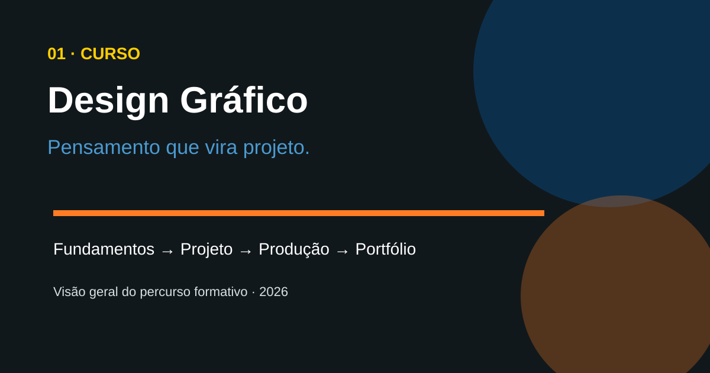
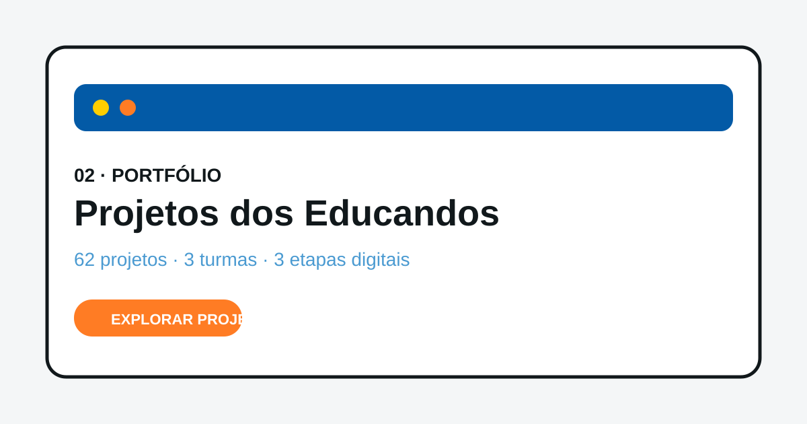
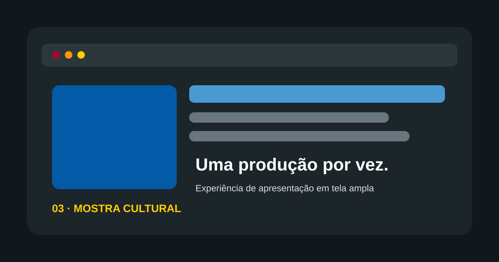
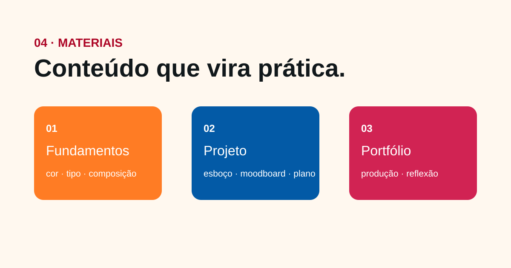
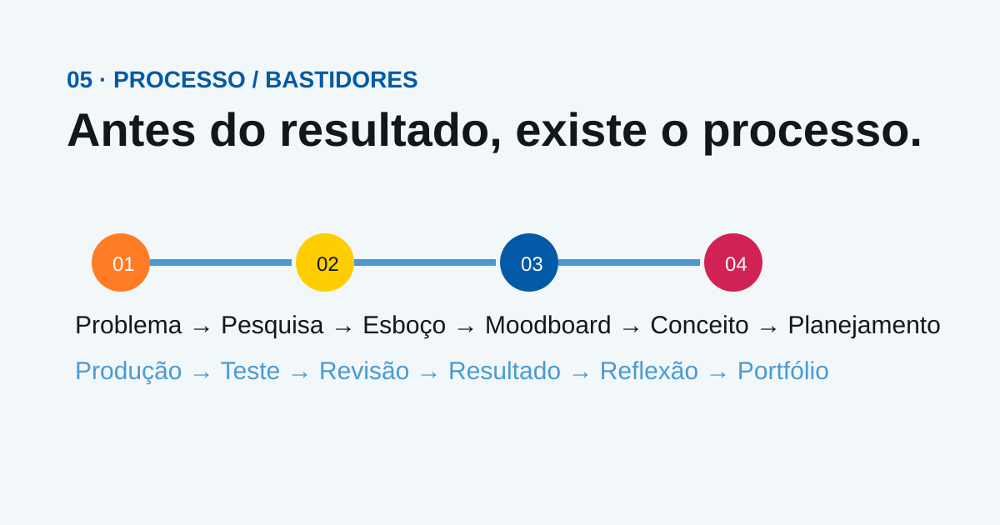
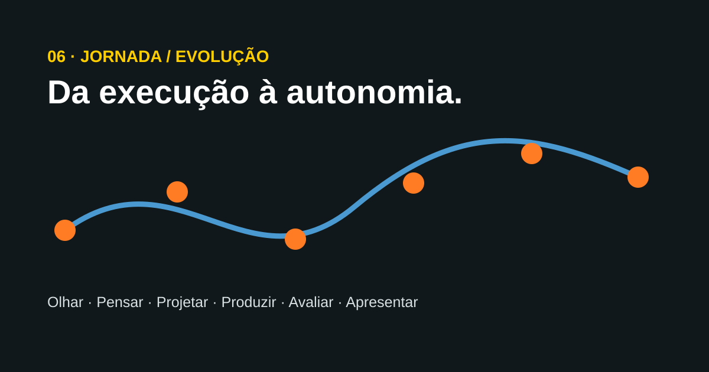

# 26_Design_Grafico

> 🇧🇷 **Português** | 🇺🇸 [English](README_EN.md) | 🇪🇸 [Español](README_ES.md)

# 🎨 PMT — Curso de Design Gráfico 2026

Este repositório documenta **um único curso de Design Gráfico**, organizado em Turma 1, Turma 2 e Turma 3 por unidade. O objetivo é registrar não apenas os produtos finais, mas principalmente **o percurso de aprendizagem: pesquisa, esboço, referência visual, planejamento, criação, revisão e apresentação**.

> **Importante:** B12 Editor, Base44 e InstaPlay não definem o curso. São ferramentas e linguagens utilizadas em uma etapa posterior do percurso para materializar ideias de Design em produtos e experiências digitais.

## 🌐 Explore o curso — 6 páginas em destaque

As seis páginas formam uma única experiência de consulta. Elas apresentam o curso em sequência: **aprendizagem → processo → produção → resultado → evolução**.

### 01 · 🎨 Curso — Design Gráfico 2026

Apresentação do curso, objetivos, percurso formativo, fundamentos, 1º e 2º semestre, metodologia e visão geral da aprendizagem.

### 02 · 🖼️ Portfólio — Projetos dos Educandos

Registro dos projetos das três turmas, com carrossel de destaque, filtros, plataformas, datas e links permanentes para as produções publicadas.

### 03 · ✨ Mostra Cultural

Experiência de apresentação em tela ampla, organizada como uma mostra digital para explorar os trabalhos um a um.

### 04 · 📚 Materiais

Galeria organizada pelos conteúdos e etapas do curso: fundamentos, cor, tipografia, esboços, moodboard, identidade, planejamento, produção e portfólio.

### 05 · 🔎 Processo / Bastidores

Mostra o que existe antes e depois da tela final: problema, pesquisa, referências, esboços, moodboard, conceito, planejamento, produção, teste, revisão e reflexão.

### 06 · 🧭 Jornada / Evolução

Apresenta a transformação da aprendizagem em seis movimentos: **Olhar, Pensar, Projetar, Produzir, Avaliar e Apresentar**.

### 🔗 Percurso recomendado

**01 Curso → 02 Portfólio → 03 Mostra → 04 Materiais → 05 Processo → 06 Jornada/Evolução**

> **Acesse as páginas acima para percorrer o curso como uma experiência completa, e não apenas como um catálogo de trabalhos.**

## ⭐ Projeto principal — Curso de Design Gráfico

O repositório deve ser lido como um **portfólio pedagógico evolutivo**. O destaque principal é o próprio percurso do curso e sua transformação em portfólios finais.

O trabalho do educador funciona como **modelo e referência de organização de portfólio**, enquanto os trabalhos dos educandos constituem os registros da aprendizagem e da evolução ao longo do curso.

### Primeiro semestre — pensar e projetar

Antes da produção digital final, o percurso trabalhou a base do Design Gráfico:

- fundamentos de comunicação visual;
- composição e organização dos elementos;
- contraste, alinhamento, proximidade e repetição;
- hierarquia e espaço em branco;
- teoria e aplicação das cores;
- tipografia e legibilidade;
- identidade visual;
- **esboços e exploração de alternativas**;
- **moodboards e pesquisa de referências**;
- desenvolvimento e amadurecimento das ideias;
- planejamento visual antes da execução.

Essa etapa é essencial: **primeiro se aprende a observar, pensar, organizar e justificar; depois se escolhe a ferramenta para produzir.**

### Segundo semestre — produzir, experimentar e apresentar

Na etapa atual, os estudos desenvolvidos anteriormente estão sendo transformados em produções digitais e, principalmente, em **estruturas finais de portfólio**.

A progressão prática é:

**B12 Editor → Base44 → InstaPlay → Portfólio**

- **B12 Editor:** criação e publicação de páginas web;
- **Base44:** criação de páginas web e aplicações com interação;
- **InstaPlay:** criação de jogos e experiências interativas;
- **Portfólio:** seleção, organização, apresentação e reflexão sobre os trabalhos.

A lógica não é aprender três ferramentas isoladas. É ampliar gradualmente o problema de Design:

> **Visual → Interação → Experiência → Apresentação profissional**

## 🧭 A trajetória completa

**Fundamentos → Esboços → Moodboard → Planejamento → Criação → Produção digital → Teste → Revisão → Portfólio**

Ou, na perspectiva do produto:

**Ideia → Briefing → Pesquisa → Conceito → Execução → Teste → Ajuste → Publicação → Portfólio**

O curso, portanto, não começou nas páginas web. As páginas, aplicações e jogos são **evidências de uma formação em Design Gráfico** que começou com linguagem visual e desenvolvimento de projeto.

## 🖼️ Portfólio-modelo e portfólios dos educandos

O **portfólio do educador** é utilizado como modelo e referência para discutir como um trabalho de Design pode ser organizado, apresentado e contextualizado.

A etapa atual busca levar os educandos a construir seus próprios portfólios, selecionando e organizando os resultados de sua trajetória.

O objetivo é que o portfólio responda a perguntas como:

- O que foi desenvolvido?
- Qual era a ideia ou problema?
- Que referências foram utilizadas?
- Como a solução foi construída?
- Quais decisões de Design foram tomadas?
- O que foi testado e revisado?
- O que o resultado demonstra sobre a aprendizagem?

## 🌐 Portfólio público

**GitHub Pages:** https://sayjinblackbelt.github.io/26_Design_Grafico/

A página pública funciona como espaço de consulta dos projetos publicados. Ela apresenta primeiro nome, turma, plataforma, data e link, conforme a finalidade pedagógica definida para o projeto.

A documentação técnica permanece sanitizada e utiliza identificadores anônimos.

## 🧩 As plataformas dentro do curso

### 1. B12 Editor — Página Web

Primeira etapa de materialização digital. Os educandos aplicam princípios de composição, hierarquia, tipografia, cor, identidade e organização de conteúdo em páginas publicáveis.

**Pergunta de projeto:** como transformar uma ideia em uma comunicação visual organizada e publicada na Web?

### 2. Base44 — Página Web + App

Ampliação do problema de Design para interfaces, componentes, fluxos, navegação e interação.

**Pergunta de projeto:** como transformar uma solução visual em uma experiência digital que o usuário possa explorar e utilizar?

### 3. InstaPlay — Criação de Jogos

Ampliação para sistemas interativos com regras, objetivos, mecânicas, feedback, narrativa e desafio, utilizando IA como apoio à criação.

**Pergunta de projeto:** como projetar uma experiência em que o usuário participa, toma decisões e recebe respostas do sistema?

## 📊 Registros atuais

| Turma | B12 | Base44 | InstaPlay | Total |
|---|---:|---:|---:|---:|
| Turma 1 | 7 | 16 | 4 | 27 |
| Turma 2 | 4 | 5 | 0 | 9 |
| Turma 3 | 13 | 13 | 0 | 26 |
| **Total** | **24** | **34** | **4** | **62** |

Os 62 registros são **evidências de uma etapa do curso**, e não a totalidade da formação em Design Gráfico.

## 🧠 Abordagem pedagógica

- Aprendizagem Baseada em Projetos (PBL)
- Sprints educacionais inspirados em Scrum
- Pedagogia Heulosófica
- Perguntas norteadoras e diálogo maiêutico
- Organização do pensamento
- Autonomia e responsabilidade
- Trabalho colaborativo
- Feedback e melhoria contínua
- Uso consciente de Inteligência Artificial
- Relação entre processo criativo e mundo do trabalho

## 📚 Conteúdos e competências

### Fundamentos de Design
Contraste, alinhamento, proximidade, repetição, hierarquia, espaço em branco, equilíbrio, formas, composição, tipografia e legibilidade.

### Pesquisa e desenvolvimento
Referências, moodboards, esboços, exploração de alternativas, conceito visual, briefing e planejamento.

### Cor e identidade
Teoria das cores, contraste, harmonia, paletas, identidade visual, logotipo, tipografia e kit de marca.

### Comunicação e narrativa
Storytelling, arquitetura da informação, narrativa visual, comunicação audiovisual e organização de mensagens.

### Produção digital
Canva, Google Apresentações, B12 Editor, Base44 e InstaPlay.

### Experiências digitais
Páginas web, aplicações, protótipos, interfaces, fluxos de interação e criação de jogos.

### Mundo do trabalho
Briefing, pesquisa, planejamento, criação, revisão, entrega, apresentação, retrospectiva, justificativa das decisões e construção de portfólio.

## 🎯 Propósito

Desenvolver educandos capazes de **observar, pensar, planejar, criar, testar, revisar, justificar e apresentar soluções de comunicação visual e experiências digitais**.

> **A ferramenta muda; o pensamento de Design permanece.**

## 🗂️ Documentação

- [📘 Fundamentos Desenvolvidos](docs/fundamentos-design-grafico-2026.md)
- [🏢 Manifesto da Agência Criativa](docs/agencia-criativa-pmt.md)
- [🧠 Metodologia](docs/metodologia-pmt-design-grafico.md)
- [📊 Relatório pedagógico semestral](docs/relatorio-pedagogico-semestral-2026.md)
- [📈 Evolução do projeto](docs/EVOLUCAO_PROJETO_DESIGN_GRAFICO_2026.md)
- [📁 Portfólio centralizado](docs/PORTFOLIO.md)
- [🌐 Registro de projetos digitais](docs/projetos-b12-educandos-2026-08-28.md)
- [🗺️ Roadmap 2026](docs/ROADMAP_DESIGN_GRAFICO_2026.md)
- [📂 Organização dos Projetos](projetos/README.md)
- [🖼️ Galeria de Exemplos Visuais](assets/exemplos/README.md)
- [📘 Guia Visual de Design Gráfico](docs/GUIA_VISUAL_DESIGN_GRAFICO_PMT.md)
- [🧭 Estrutura Definitiva da Apostila 2026](docs/ESTRUTURA_DEFINITIVA_APOSTILA_DESIGN_GRAFICO_2026.md)

## 🔒 Privacidade

A documentação técnica utiliza identificadores anônimos. O GitHub Pages pode exibir o primeiro nome dos educandos por ser espaço de consulta pedagógica. Não devem ser publicados sobrenomes, dados individuais de avaliação, contatos, credenciais, senhas, tokens ou outras informações pessoais desnecessárias.

## 📈 Status

🟢 **Curso em desenvolvimento contínuo — portfólio pedagógico em consolidação**
