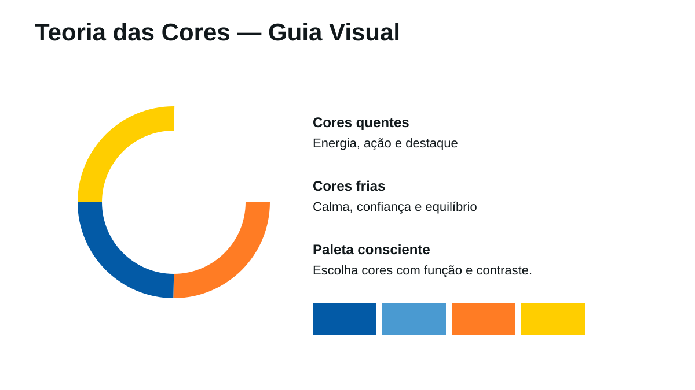
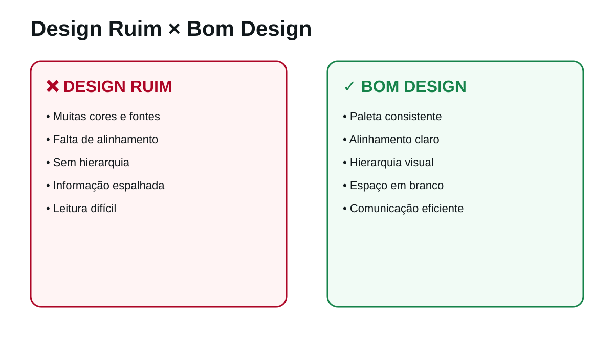
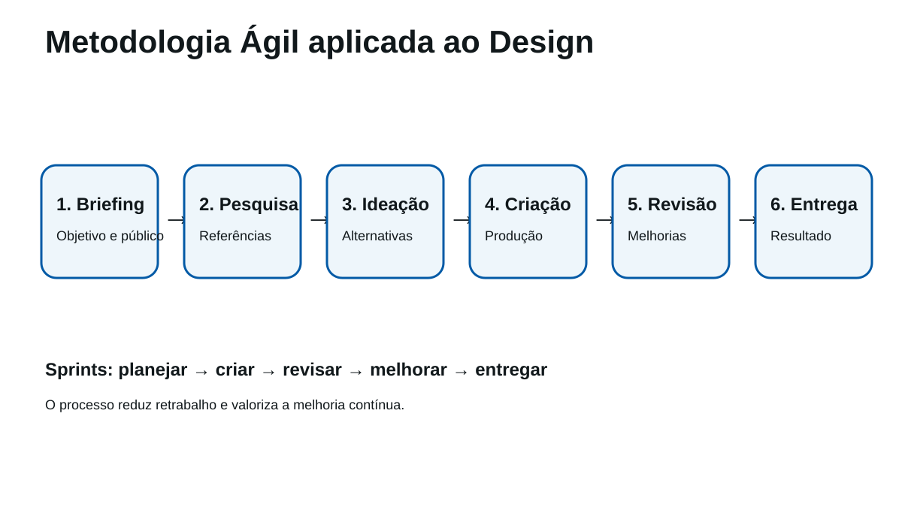
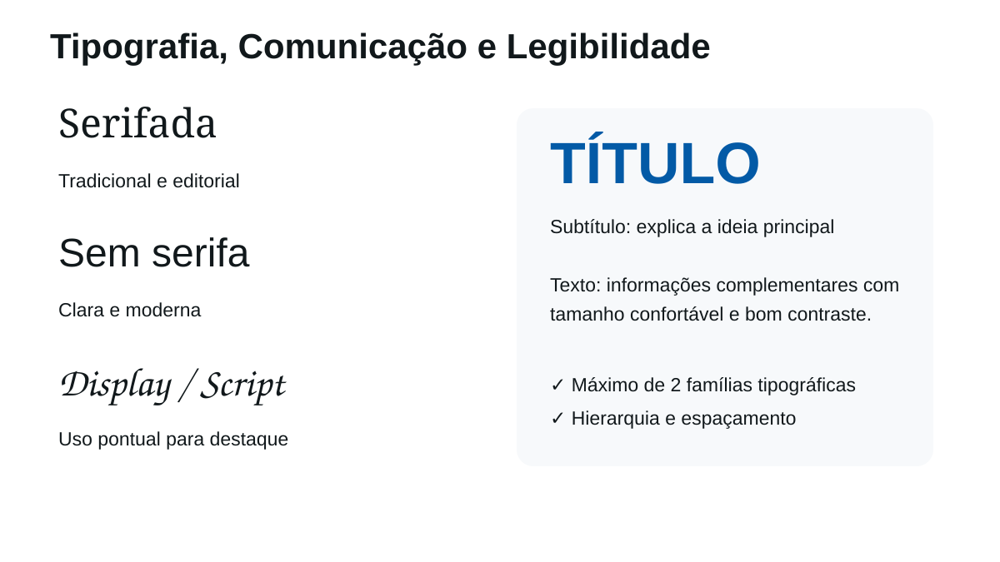

# 📘 Guia Visual de Design Gráfico PMT

##  | Preparação para o Mundo do Trabalho

Este guia reúne conceitos fundamentais já trabalhados na oficina de **Design Gráfico**, com exemplos visuais e exercícios práticos.

> **Objetivo:** aprender a observar, analisar e tomar decisões visuais conscientes.

---

# 🎨 1. Os 7 Princípios do Design Gráfico

## Contraste
Utilize diferenças de tamanho, cor, peso ou forma para destacar o que é mais importante.

## Alinhamento
Organize os elementos seguindo referências visuais. Evite objetos aparentemente colocados ao acaso.

## Proximidade
Informações relacionadas devem ficar próximas para facilitar a compreensão.

## Repetição
Repita cores, estilos, formas ou padrões para criar unidade visual.

## Hierarquia
Mostre ao leitor o que deve ser visto primeiro, depois e por último.

## Espaço em branco
Nem todo espaço precisa ser preenchido. O vazio também ajuda a organizar e valorizar informações.

## Equilíbrio
Distribua os elementos para evitar sensação de excesso de peso em apenas uma área.

### ✏️ Exercício rápido
Observe um slide, cartaz ou página e responda:

1. O que vejo primeiro?
2. Os elementos estão alinhados?
3. Existe espaço suficiente para respirar visualmente?
4. Quais princípios estão funcionando melhor?
5. O que eu mudaria?

---

# 🌈 2. Teoria das Cores

As cores ajudam a comunicar ideias, criar destaque e construir identidade.

## Conceitos básicos

- **Cores quentes:** podem transmitir energia, movimento e destaque.
- **Cores frias:** podem transmitir calma, confiança e equilíbrio.
- **Contraste:** ajuda elementos importantes a se destacarem.
- **Harmonia:** cria relações visuais agradáveis entre as cores.

### Regra prática
Antes de começar um projeto, escolha uma paleta limitada e defina a função de cada cor.

Exemplo:

- Cor principal → identidade
- Cor secundária → apoio
- Cor de destaque → chamar atenção
- Neutros → fundo e textos

### ✏️ Exercício rápido
Escolha um tema e monte uma paleta com 3 a 5 cores. Depois explique:

- Qual é a cor principal?
- Qual será usada para destaque?
- A combinação tem contraste suficiente?

---

# ❌ 3. Design Ruim × ✅ Bom Design

Um bom projeto gráfico não depende de colocar muitos efeitos.

## Sinais de problemas

- excesso de cores;
- muitas fontes;
- textos longos;
- falta de alinhamento;
- ausência de hierarquia;
- pouco contraste.

## Boas práticas

- limitar a paleta;
- usar poucas famílias tipográficas;
- criar hierarquia;
- alinhar elementos;
- utilizar espaço em branco;
- revisar antes da entrega.

### ✏️ Exercício rápido
Escolha um design existente e faça duas listas:

**Manter:** o que funciona bem.  
**Melhorar:** o que prejudica a comunicação.

---

# 🔄 4. Metodologia Ágil aplicada ao Design

Projetos profissionais raramente ficam perfeitos na primeira tentativa.

## Processo

**Briefing → Pesquisa → Ideação → Criação → Revisão → Entrega**

### Briefing
Entender objetivo, público e mensagem.

### Pesquisa
Buscar informações e referências confiáveis.

### Ideação
Pensar em possibilidades antes de escolher uma solução.

### Criação
Produzir uma primeira versão.

### Revisão
Identificar problemas e oportunidades de melhoria.

### Entrega
Preparar o arquivo final no formato solicitado.

## Sprints Educacionais

A metodologia utilizada na oficina pode ser resumida assim:

**Planejar → Criar → Revisar → Melhorar → Entregar**

Cada Sprint gera uma entrega parcial e permite aprender com o processo.

### ✏️ Exercício rápido
Antes de iniciar qualquer projeto, escreva:

- Qual é o objetivo?
- Quem é o público?
- Qual é a mensagem principal?
- O que precisa ser entregue?
- Como saberemos que o trabalho está pronto?

---

# 🔤 5. Tipografia e Legibilidade

Tipografia é a organização visual do texto.

## Recomendações básicas

- utilizar no máximo duas famílias tipográficas;
- criar diferença clara entre título e texto;
- evitar fontes decorativas em textos longos;
- garantir contraste;
- utilizar tamanho confortável;
- deixar espaço entre blocos de informação.

## Hierarquia tipográfica

**TÍTULO**  
Informação principal.

**Subtítulo**  
Explica ou complementa.

Texto corrido  
Apresenta detalhes necessários.

### ✏️ Exercício rápido
Pegue um texto simples e transforme-o em:

1. título;
2. subtítulo;
3. informação principal;
4. detalhes complementares.

Observe como tamanho, peso e espaço modificam a leitura.

---

# 🧩 Checklist antes da entrega

## Mensagem
- [ ] O objetivo está claro?
- [ ] O público compreenderá o conteúdo?

## Organização
- [ ] Existe hierarquia?
- [ ] Os elementos estão alinhados?
- [ ] Informações relacionadas estão próximas?

## Cor
- [ ] A paleta é consistente?
- [ ] Existe contraste suficiente?

## Tipografia
- [ ] O texto está legível?
- [ ] Não existem fontes em excesso?

## Qualidade
- [ ] O conteúdo foi revisado?
- [ ] Há erros de escrita?
- [ ] O arquivo está no formato solicitado?

---

# 🚀 Próxima etapa

Este guia prepara a continuidade do percurso:

**Fundamentos → Canva → Identidade Visual → Kit de Marca → Projeto Autoral → Portfólio**

> **Design Gráfico não é apenas utilizar uma ferramenta. É observar, organizar, testar, justificar escolhas e melhorar a comunicação visual.**
