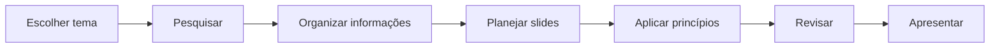

# 🎨 Projeto 01 — Aplicando os 7 Princípios do Design

## Objetivo
Aplicar princípios fundamentais do Design Gráfico em uma apresentação criada no Google Apresentações.

## Briefing
Em duplas ou trios, escolher um tema de interesse e transformar pesquisa e ideias em uma apresentação visual clara e organizada.

## Princípios trabalhados
1. **Contraste** — destacar o que importa.
2. **Alinhamento** — organizar visualmente.
3. **Proximidade** — agrupar informações relacionadas.
4. **Repetição** — criar unidade.
5. **Hierarquia** — orientar a leitura.
6. **Espaço em branco** — dar clareza e respiro.
7. **Equilíbrio** — distribuir o peso visual.

## Fluxo do projeto

## Estrutura sugerida
- Slide 1: título + imagem principal
- Slide 2: informação principal
- Slide 3: curiosidade ou destaque
- Slide 4: complemento
- Slide 5: reflexão e conexão pedagógica

## Exemplo visual

| ❌ Antes | ✅ Depois |
|---|---|
| Muitas fontes e cores | Paleta limitada e consistente |
| Texto espalhado | Alinhamento definido |
| Tudo com o mesmo tamanho | Hierarquia clara |
| Imagens aleatórias | Imagens relacionadas à mensagem |
| Sem espaço livre | Espaço em branco intencional |

## Competências
**Hard skills:** composição, hierarquia, cor, pesquisa e Google Apresentações.  
**Soft skills:** colaboração, organização, criatividade e revisão.

> **Aprender Design significa compreender por que uma escolha visual funciona, e não apenas deixar algo bonito.**
