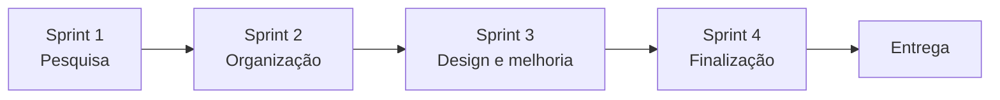

# 🌻 Projeto 02 — Folder Institucional | 18 de Maio

## Tema
**18 de maio — Combate ao Abuso e à Exploração Sexual de Crianças e Adolescentes**

## Propósito
Desenvolver um material gráfico informativo com foco em **conscientização, proteção, orientação e responsabilidade social**.

O conteúdo foi planejado para circulação institucional junto a **crianças, adolescentes, famílias e escolas da região**. Por isso, a comunicação deve ser clara, ética e não sensacionalista.

## Metodologia ágil



## Sprints

### Sprint 1 — Pesquisa
- compreender a importância da data;
- pesquisar informações confiáveis;
- pensar no público.

### Sprint 2 — Organização
- definir mensagem principal;
- selecionar informações essenciais;
- criar frases curtas e claras.

### Sprint 3 — Produção e melhoria
- organizar conteúdo visual;
- aplicar princípios do Design;
- revisar clareza e adequação.

### Sprint 4 — Finalização
- preparar o folder dobrável;
- revisar frente e verso;
- exportar em PDF para impressão.

## Estrutura gráfica

**Formato:** folha A4 em paisagem, frente e verso, dobrada em três partes.

```text
FRENTE DA FOLHA
┌──────────┬──────────┬──────────┐
│ Painel 1 │ Painel 2 │ Painel 3 │
│ chamada  │ destaque │ capa     │
└──────────┴──────────┴──────────┘

VERSO DA FOLHA
┌──────────┬──────────┬──────────┐
│ conteúdo │ orientação│ ajuda   │
│          │           │ Disque │
└──────────┴──────────┴──────────┘
```

## Checklist final
- [ ] linguagem adequada ao público;
- [ ] mensagem clara;
- [ ] informações organizadas;
- [ ] contraste suficiente;
- [ ] hierarquia visual;
- [ ] imagens adequadas;
- [ ] revisão ortográfica;
- [ ] arquivo final em PDF.

> **Design com propósito social exige responsabilidade: informar sem assustar e orientar sem simplificar excessivamente.**
