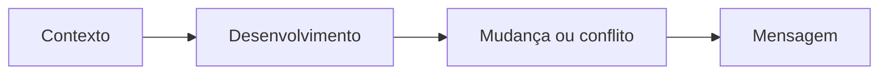

# 📖 Projeto 03 — Storytelling e Narrativa Visual

## Objetivo
Compreender como imagens, textos e sequência podem construir uma mensagem.

## Estrutura

## Perguntas norteadoras
- O que aconteceu?
- O que é importante nessa situação?
- Como o público deve interpretar?
- Qual mensagem permanece no final?

## Aplicação visual
Uma narrativa pode ser construída por:

**Imagem + Texto + Sequência + Ritmo + Música**

## B12 Editor
A ferramenta foi utilizada para experimentar:
- sequência de cenas;
- seleção de imagens;
- texto curto;
- ritmo;
- mensagem final.

## Exemplo simples

**Cena 1:** uma situação inicial.  
**Cena 2:** surge um problema ou mudança.  
**Cena 3:** ocorre uma decisão.  
**Cena 4:** aparece a consequência.  
**Cena 5:** mensagem final.

## Competências
- síntese;
- comunicação;
- criatividade;
- organização narrativa;
- tomada de decisões visuais.

> **Storytelling não é apenas contar uma história: é organizar acontecimentos para que uma mensagem faça sentido.**
