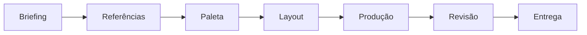

# 🖥️ Projeto 04 — Canva e Criação Visual

## Status
🔄 Em desenvolvimento

## Objetivo
Ampliar o repertório de criação visual e aplicar os fundamentos já estudados em uma nova ferramenta.

## Regra principal

> **O Canva é uma ferramenta. Os princípios de Design continuam sendo a base das decisões.**

## Fluxo de criação

## Exercício guiado sugerido
Criar uma peça gráfica simples seguindo este processo:

1. escolher um tema;
2. definir o público;
3. selecionar 3 a 5 cores;
4. escolher no máximo 2 famílias tipográficas;
5. criar uma hierarquia visual;
6. aplicar alinhamento e espaço em branco;
7. revisar antes de finalizar.

## Comparação

### ❌ Uso automático de template
Template → trocar texto → exportar

### ✅ Uso consciente
Briefing → objetivo → referências → adaptar template → aplicar princípios → revisar → exportar

## Próxima conexão
O projeto prepara o caminho para:
- identidade visual;
- Kit de Marca;
- projetos autorais;
- portfólio.
