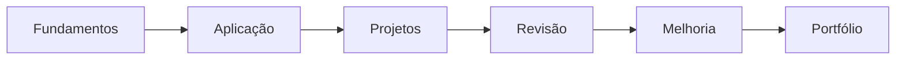

# 📁 Projetos — Design Gráfico 2026

Esta área organiza os projetos práticos desenvolvidos na oficina de **Design Gráfico**, funcionando como histórico pedagógico e demonstração de processos.

## Projetos

### 01. 🎨 [Aplicando os 7 Princípios do Design](01_7_Principios_Do_Design/README.md)
Apresentação prática para aplicar contraste, alinhamento, proximidade, repetição, hierarquia, espaço em branco e equilíbrio.

### 02. 🌻 [Projeto Institucional — 18 de Maio](02_Projeto_18_De_Maio/README.md)
Folder informativo desenvolvido com metodologia ágil, Sprints, pesquisa, organização, revisão e preparação para impressão.

### 03. 📖 [Storytelling e Narrativa Visual](03_Storytelling_e_Narrativa_Visual/README.md)
Desenvolvimento de narrativa por meio de imagem, texto, sequência, ritmo e mensagem.

### 04. 🖥️ [Canva e Criação Visual](04_Canva_e_Criacao_Visual/README.md)
Ampliação das ferramentas de criação mantendo os fundamentos do Design como referência.

## Estrutura padrão
Cada projeto pode conter:

- objetivo;
- briefing;
- competências;
- etapas ou Sprints;
- ferramentas;
- exemplos;
- critérios de avaliação;
- reflexão;
- resultado esperado.

## Visão do percurso

> A documentação pública é sanitizada e não inclui dados pessoais desnecessários dos educandos.
